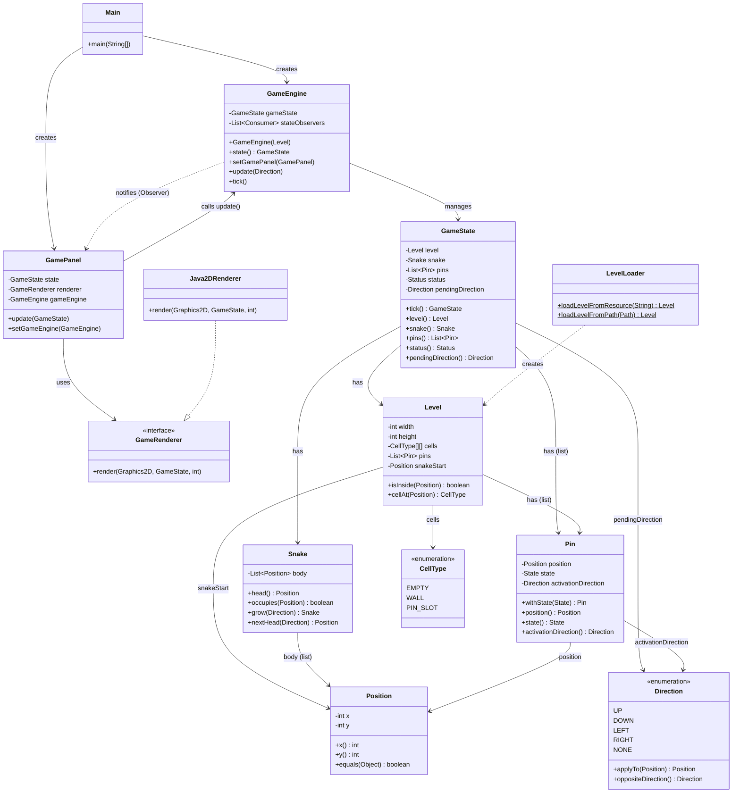

# Aufgabe 2.1 – UML-Klassendiagramm

## Beschreibung der wichtigsten Beziehungen

- **`GameEngine`** verwaltet den `GameState` und benachrichtigt `GamePanel` bei jeder Änderung (Observer-Pattern).
- **`GamePanel`** sendet Tastatureingaben als `Direction` an `GameEngine.update()` (GameEngine als Observer).
- **`GameState`** ist immutabel – `tick()` gibt immer einen neuen Zustand zurück.
- **`Java2DRenderer`** implementiert das `GameRenderer`-Interface.
- **`LevelLoader`** liest die Level-Datei ein und erzeugt ein `Level`-Objekt.
